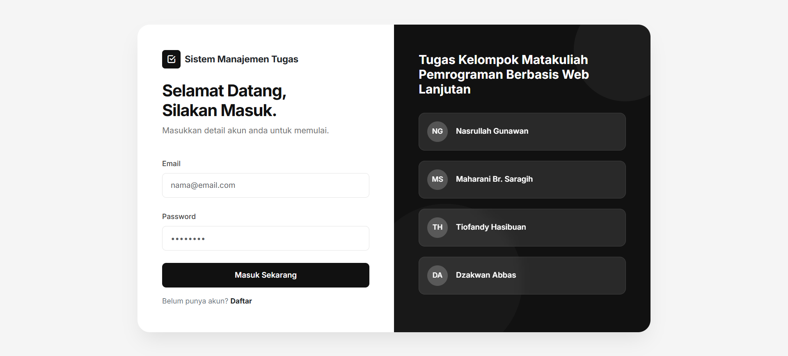
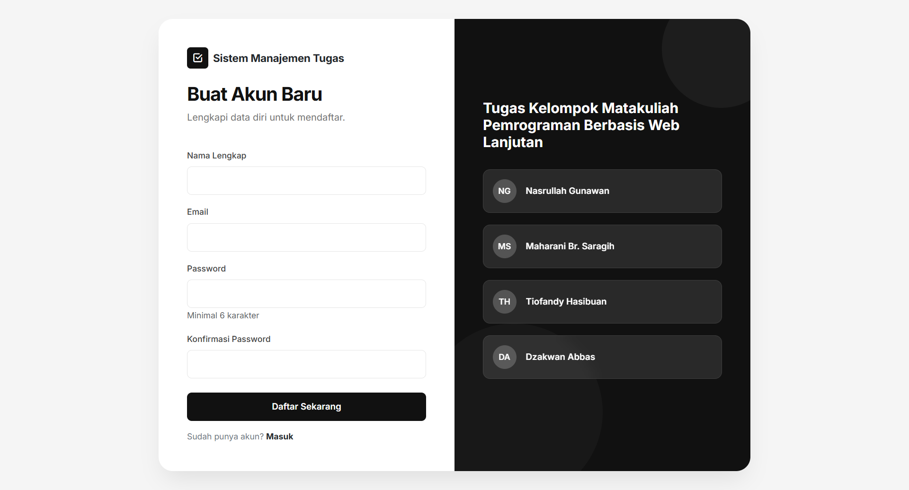
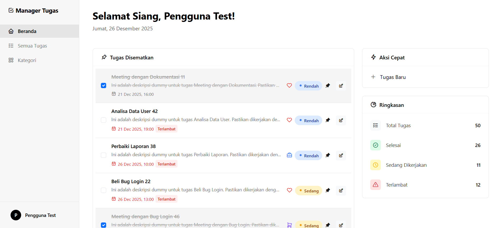
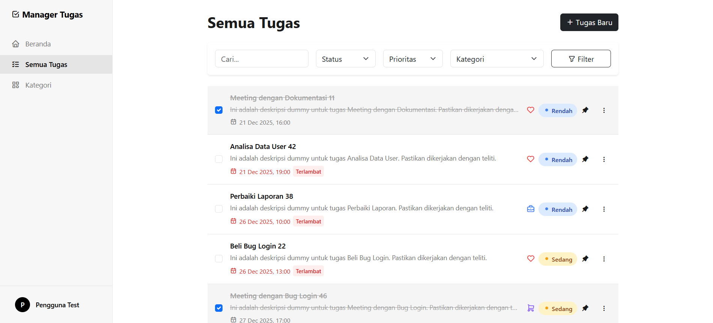
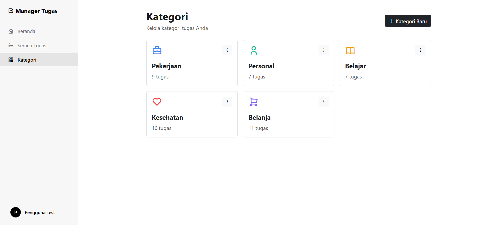

# Sistem Manajemen Tugas 📝


Sebuah aplikasi manajemen tugas berbasis web yang dirancang untuk produktivitas harian. Dibangun dengan fokus pada desain minimalis (Clean UI), kecepatan, dan kemudahan penggunaan. Proyek ini dibuat sebagai **Tugas Kelompok Mata Kuliah Pemrograman Berbasis Web Lanjutan**.

---

## ✨ Fitur Utama

### 1. Dashboard Interaktif

-   **Statistik Ringkas:** Lihat total tugas, selesai, sedang dikerjakan, dan terlambat dalam satu pandangan.
-   **Tugas Disematkan:** Akses cepat ke tugas-tugas prioritas tinggi (Pinned).
-   **Tugas Terbaru:** Monitoring tugas yang baru saja ditambahkan.

### 2. Manajemen Tugas (CRUD)

-   **Modal Based:** Tambah dan edit tugas tanpa reload halaman (AJAX).
-   **Prioritas & Kategori:** Kelompokkan tugas berdasarkan warna kategori dan tingkat urgensi (Rendah, Sedang, Tinggi).
-   **Deadline & Pengingat:** Penanda otomatis untuk tugas yang terlambat (Overdue).
-   **Status Progres:** Flow status (Tertunda -> Sedang Dikerjakan -> Selesai).

### 3. Manajemen Kategori

-   **Kustomisasi:** Buat kategori sendiri dengan pilihan warna dan ikon (Tabler Icons).
-   **Filter Cepat:** Klik kartu kategori untuk memfilter tugas terkait.

### 4. User Experience (UX) Premium

-   **Clean UI:** Desain "Black & White Minimalist" terinspirasi dari tool produktivitas modern (Notion-like).
-   **Responsive:** Tampilan optimal di desktop maupun mobile.
-   **Fast Interactions:** Hampir semua aksi (Checklist, Hapus, Edit) berjalan instan tanpa refresh.

---

## 🛠️ Tech Stack

-   **Backend:** Laravel 12 (PHP Framework)
-   **Frontend:** Blade Templates, Bootstrap 5, Custom CSS
-   **Scripting:** jQuery (AJAX Handling), SweetAlert2 (Notifikasi)
-   **Database:** MySQL
-   **Icons:** Tabler Icons

---

## 👥 Anggota Kelompok

1. **Nasrullah Gunawan**
2. **Maharani Br. Saragih**
3. **Tiofandy Hasibuan**
4. **Dzakwan Abbas**

---

## 🚀 Cara Instalasi

1. **Clone Repository**

    ```bash
    git clone https://github.com/nasgunawann/todo-laravel.git
    cd todo-laravel
    ```

2. **Install Dependencies**

    ```bash
    composer install
    ```

3. **Setup Environment**

    - Copy file `.env.example` ke `.env`
    - Setting database di `.env`

    ```bash
    cp .env.example .env
    php artisan key:generate
    ```

4. **Migrasi Database & Seeding**

    ```bash
    php artisan migrate --seed
    ```

    _(Seed akan membuat akun test: email `test@example.com`, password `password`)_

5. **Jalankan Aplikasi**
    ```bash
    php artisan serve
    ```
    Buka `http://localhost:8000` di browser.

---

## 📸 Screenshot

|            Halaman Login            |             Halaman Register              |
| :---------------------------------: | :---------------------------------------: |
|  |  |

|           Dashboard Beranda            |           Daftar Tugas            |
| :------------------------------------: | :-------------------------------: |
|  |  |

|          Manajemen Kategori          |
| :----------------------------------: |
|  |
